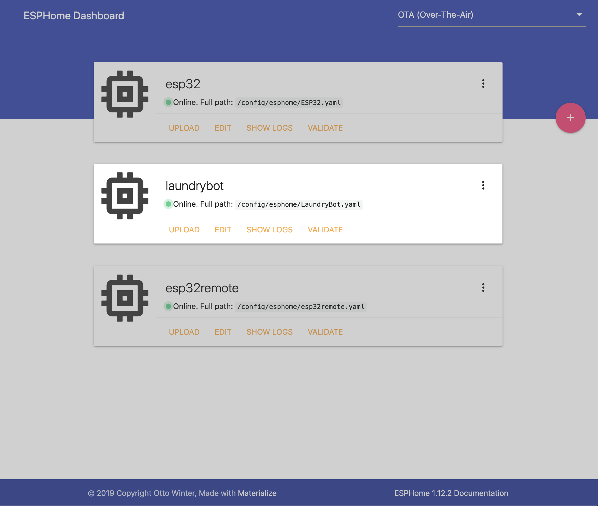
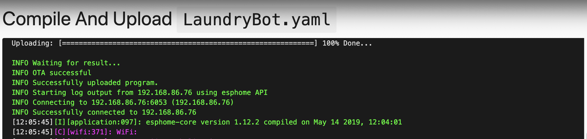
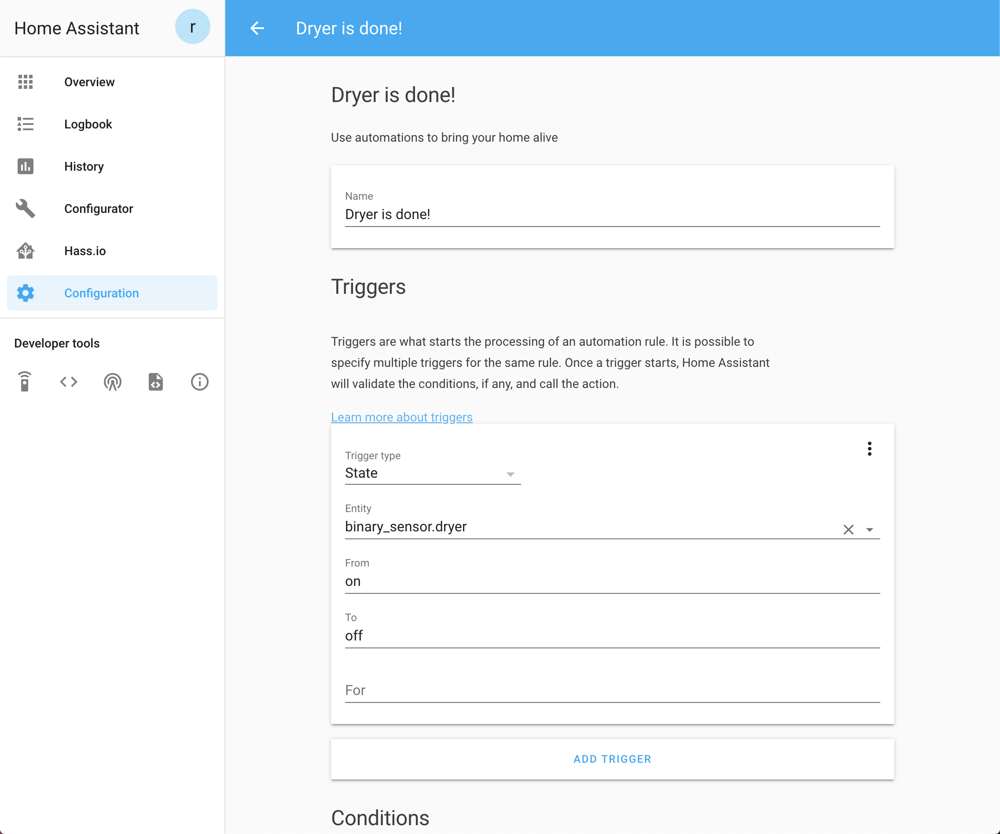
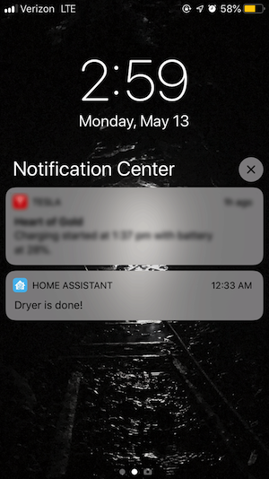

# LaundryBot
These days there is no shortage of _smart_ appliances. But does that mean we should neglect our _simple_ pre-IoT machines just because they can't send a push notification?

I invite you to explore one way to get alerts about the state of any appliance regardless of its _smartness_ based on signal from a binary sensor. In this example I'm attaching an SW-420 vibration sensor to the back of a washer and dryer in a shared house to allow remote notification based on laundry room activity. 

While this guide centers around washer and dryer units, this concept may be extended to other appliances. For instance, you could use a thermocouple to send an alert when the oven is ready, etc.

To follow this guide you will need [Home Assistant](https://www.home-assistant.io/) running on the same network as the sensor unit.

> ## [Home Assistant](https://www.home-assistant.io/)
> Open source home automation that puts local control and privacy first.

There are other ways (IFTTT, Slack, Twitter) to get alerts from a sensor to your phone but these are a great topic for [another guide](https://github.com/Shmoopty/rpi-appliance-monitor).

## Disclaimer
This guide assumes that the reader has intermediate knowledge and experience with electronics prototyping, soldering, scripting, and debugging. 
As with any project there are many ways to acheive the desired result and this is just one of them. 
While I hope this is helpful, I offer no warranty and assume no liability for the result of following any or all of the instructions in this guide.

## Here's what you'll need
- Home Assistant running on the local network
- Home Assistant companion app running on iOS
- ESP32
- SW-420 Normally Closed Vibration Sensor Module
- 22AWG stranded wire
- soldering kit or connector kit
- mini breadboard
- plastic enclosure
- USB cable

## Step 1: Set up the software
1. Connect ESP32 and SW-420 to a breadboard. The red LED next to the USB port on the [Huzzah32](https://learn.adafruit.com/adafruit-huzzah32-esp32-feather/pinouts) is directly connected to GPIO#13. I decided to plug in the data line there to see if things were registering on the ESP32. Even without installing the functional code, the LED on the ESP32 started blinking when I gave the board a gentle tap.

2. Install [Home Assistant](https://www.home-assistant.io/getting-started/)

3. Install [ESPHome](https://www.home-assistant.io/components/esphome/)

4. Compile and upload [LaundryBot.yaml](./LaundryBot.yaml) script to ESP32 using [ESPHome](https://esphome.io/guides/getting_started_hassio.html)

## Step 2: Set up the hardware
1. I had originally planned on terminating the wires with BLS connectors and connecting the female BLS connector directly to the SW-420. I was concerned that using this type of connector in a vibration-intensive environment would add an unnecessary risk and decided to solder the connections instead.

2. Cut out [perfboard](https://learn.adafruit.com/collins-lab-breadboards-and-perfboards/learn-more) and solder the sensor wires and the SW-420 to the perfboard.

3. Connect SW-420 sensors to ESP32.

4. Install sensor enclosures and plug in ESP32.

5. Configure the sensor in the Integrations tab of Home Assistant.

6. Create a basic automation from the Automation menu within the Configuration tab.

7. Once the automation is created, edit the automation in the [automations.yaml](./automations.yaml) file, replacing _yourdevice_ with your actual device name.
8. Try to trigger the sensor and adjust the sensitivity control on the SW-420 until the desired threshold is acheived.

9. If everything is working, you should be able to receive notifications in the Home Assistant iOS app.

> Copyright 2019 Ryan Moore

   Licensed under the Apache License, Version 2.0 (the "License");
   you may not use this file except in compliance with the License.
   You may obtain a copy of the License at

       http://www.apache.org/licenses/LICENSE-2.0

   Unless required by applicable law or agreed to in writing, software
   distributed under the License is distributed on an "AS IS" BASIS,
   WITHOUT WARRANTIES OR CONDITIONS OF ANY KIND, either express or implied.
   See the License for the specific language governing permissions and
   limitations under the License.
